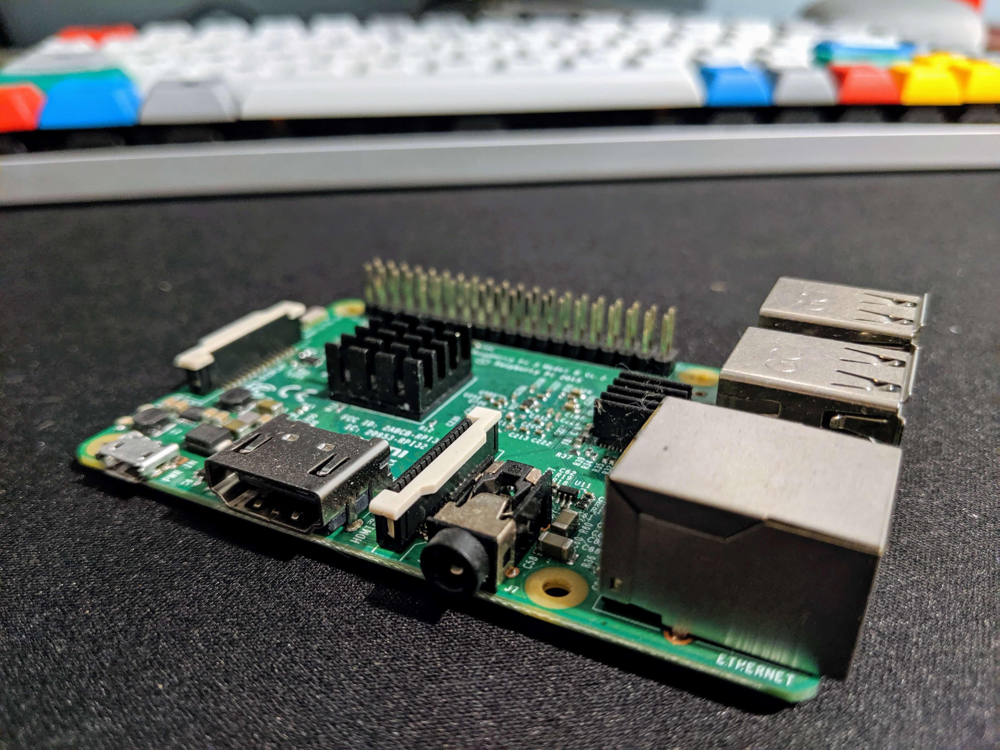
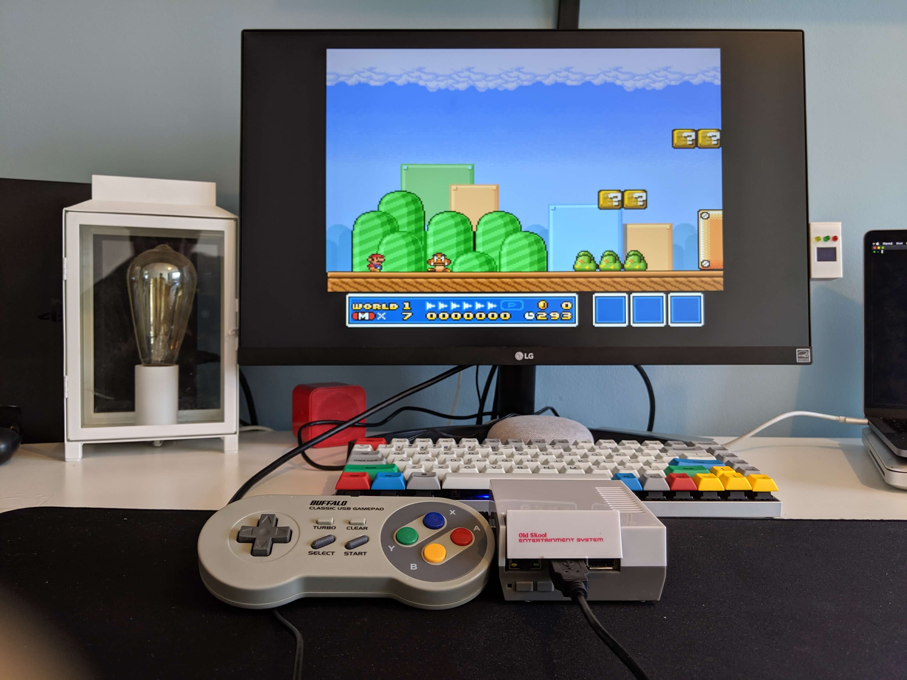

# Retro Pi

Aim - To use a Raspberry Pi to play retro games.

## Components</h2>
- In order to build this project I needed the following

### Raspberry Pi 3B+

The [Raspberry Pi 3B+](https://www.raspberrypi.org/products/raspberry-pi-3-model-b-plus/) has 1GB ram, and a 1.4GHz 64-bit quad-core processor. This is enough to run the majority of Snes, N64, PS1 and Megadrive games. I added some heat sinks to the board to draw as much heat from the Raspberry Pi as possible.

            
### Nes Case and USB SNES controllers</h3>
I found a sweet little NES-like case for the Raspberry Pi, and some SNES-like USB controller pads on [Amazon](https://www.amazon.co.uk) to give the project that nice retro look and feel.

[retro pi](./img/retro-pi.jpg)            

## How
      
### Install the Operating System

First of all I installed the [Raspbian OS](https://www.raspberrypi.org/downloads/raspbian/) onto the Pi using [these instructions](https://www.raspberrypi.org/documentation/installation/installing-images/). You can find installs which come with RetroPie pre-installed on. However I like the flexibility / added control which comes with doing this manually.

### 2. Configure WiFi

I then connected the Raspberry Pi to my WiFi network as per the [documentation](https://www.raspberrypi.org/documentation/configuration/wireless/wireless-cli.md). There are two reasons why I installed WiFi - 1) RetroPie has a few features which require an internet connection, and 2) I like connecting to the Raspberry Pi over [ssh](https://retropie.org.uk/docs/SSH/),
rather than connecting a keyboard, mouse and monitor to it.

### Install RetroPie

Next I installed [RetroPie](https://retropie.org.uk/) onto the operating system using [these instructions](href="https://retropie.org.uk/download/#Raspbian_on_a_Raspberry_Pi).

### Add Game ROMs
Once RetroPie was installed, I transferred my game ROMs from my mac to my Raspberry Pi over ssh using the scp command [other options](https://retropie.org.uk/docs/Transferring-Roms/) are available. Once on the Raspberry Pi, I moved the ROMs into the correct folder (the retropie/roms folder), and that was it!

## The Result

As a result of all the above, RetroPie will startup when the Raspberry Pi is switched on:

And there you have it, a retro console built from a Raspberry Pi. It may not be the most involved / exciting thing to build, but the end product is great fun!
